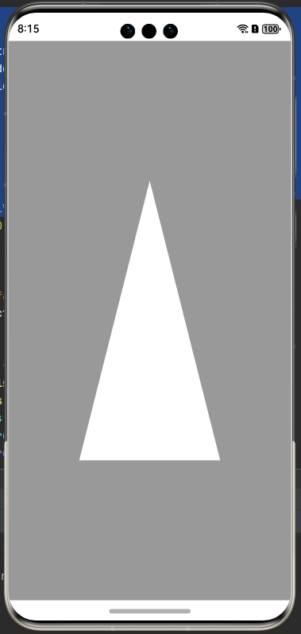

# @jemoc/glview

---

## 简单介绍

GLView组件可以在arkTs侧进行opengl和egl操作。支持按需渲染和连续渲染

## GLView

### 接口

```typescript
GLView({ options: { controller: GLViewController, eglContextClientVersion: number, renderMode: GLViewRenderMode } })
```

| 参数名                     | 类型               | 必填 | 说明                                                                            |
|-------------------------|------------------|----|-------------------------------------------------------------------------------|
| controller              | GLViewController | 否  | 渲染控制器,需要开发者实现onSurfaceCreated、onSurfaceDestroy、onSurfaceChanged、onDrawFrame方法 |
| eglContextClientVersion | number           | 否  | 设置egl context client版本，默认值2                                                   |
| renderMode              | GLViewRenderMode | 否  | 设置组件渲染模式， 默认值 WHEN_DIRTY                                                      |
| onCreated               | Function         | 否  | egl初始化成功回调                                                                    |

### GLViewRenderMode

| 枚举名          | 说明                                                                         |
|--------------|----------------------------------------------------------------------------|
| WHEN_DIRTY   | 按需渲染/手动渲染，当onSurfaceCreated回调后会自动绘制一帧。开发者需要通过controller调用requestRender进行绘制 |
| CONTINUOUSLY | 连续渲染， 组件通过vSync进行连续渲染                                                      |

### GLViewController

#### onSurfaceCreated(): void

组件创建Surface成功时调用此方法，开发者可以在此方法初始化opengl所需要的资源

#### onSurfaceChanged(rect: SurfaceRect): void

组件Surface大小改变时调用此方法

#### onSurfaceDestroy(): void

组件Surface销毁时调用此方法，开发者需要在此方法销毁opengl资源

#### onDrawFrame(timestamp: number, targetTimeStamp: number): void

组件绘制每一帧都会调用此方法

#### setEGLContextClientVersion(version: number): void

设置egl context client版本。此方法需要在onSurfaceCreated前使用。此方法与组件接口eglContextClientVersion冲突。

#### setRenderMode(mode: GLViewRenderMode):void

更改组件渲染模式

#### makeCurrent(): boolean

绑定egl上下文

#### swapBuffer(): void

交换前缓冲区和后缓冲区

---

### 下载安装

```shell
ohpm install @jemoc/glview
```

### 示例

#### 实现GLViewController

```typescript
import { GLViewController, gles } from '@jemoc/glview'

class MyController extends GLViewController {
  private program: number = 0;
  private vao: number = 0;
  private vbo: number = 0

  //nativeImage: gles.NativeImage;

  // constructor() {
  //   super();
  //   //使用NativeImage同层渲染或渲染视频帧
  //   //详细用法见@jemoc/gles
  //   this.nativeImage = new gles.NativeImage();
  // }

  onSurfaceChanged(rect: SurfaceRect): void {
    gles.glViewport(0, 0, rect.surfaceWidth, rect.surfaceHeight);
  }

  onSurfaceDestroyed(): void {
    //回收buffer和program
    gles.glDeleteBuffers([this.vbo]);
    gles.glDeleteProgram(this.program);
    gles.glDeleteVertexArrays([this.vao]);
  }

  onSurfaceCreated(): void {
    //创建shader
    let vertexShaderSource =
      `version 300 es
        layout(location = 0) in vec4 a_position;
        layout(location = 1) in vec4 a_color;
        out vec4 v_color;
        void main()
        {
            gl_Position = a_position;
            v_color = a_color;
        }`;

    let fragmentShaderSource =
      `#version 300 es
      precision mediump float;
      in vec4 v_color;
      out vec4 fragColor;
      {
          fragColor = v_color;
      }`;

    let vertexShader = gles.glCreateShader(gles.GL_VERTEX_SHADER);
    let fragmentShader = gles.glCreateShader(gles.GL_FRAGMENT_SHADER);
    let program = gles.glCreateProgram();
    gles.glShaderSource(vertexShader, vertexShaderSource);
    gles.glCompileShader(vertexShader);
    let result = gles.glGetShaderiv(vertexShader, gles.GL_COMPILE_STATUS);


    if (!result) {
      let info = gles.glGetShaderInfoLog(vertexShader);
      console.log(info);
    }
    gles.glShaderSource(fragmentShader, fragmentShaderSource);
    gles.glCompileShader(vertexShader);
    result = gles.glGetShaderiv(fragmentShader, gles.GL_COMPILE_STATUS);
    if (!result) {
      let info = gles.glGetShaderInfoLog(fragmentShader);
      console.log(info);
    }
    gles.glAttachShader(program, vertexShader);
    gles.glAttachShader(program, fragmentShader);
    gles.glLinkProgram(program);
    let status = gles.glGetProgramiv(program, gles.GL_LINK_STATUS);
    if (!status) {
      let info = gles.glGetProgramInfoLog(program);
      console.log(info);
    }
    gles.glDeleteShader(vertexShader);
    gles.glDeleteShader(fragmentShader);

    this.program = program;

    let vertex_list = new Float32Array([
      -0.5, -0.5, 0.0,
      0.5, -0.5, 0.0,
      0.0, 0.5, 0.0
    ]);

    //创建vao vbo
    let vao_list = gles.glGenVertexArrays(1);
    let bufs = gles.glGenBuffers(1);
    let vao = vao_list[0];
    let vbo = bufs[0];
    gles.glBindBuffer(gles.GL_ARRAY_BUFFER, vbo);
    gles.glBindVertexArray(vao);
    gles.glBindBuffer(gles.GL_ARRAY_BUFFER, vbo);
    gles.glBufferData(gles.GL_ARRAY_BUFFER, vertex_list.buffer, gles.GL_STATIC_DRAW);

    gles.glVertexAttribPointer(0, 3, gles.GL_FLOAT, gles.GL_FALSE, 12, 0);
    gles.glEnableVertexAttribArray(0);

    this.vbo = vbo;
    this.vao = vao;
  }

  onDrawFrame(timestamp: number, targetTimestamp: number): void {
    // 更新NativeImage
    // if (this.nativeImage.isAvailable) {
    //   if (this.nativeImage.textureId == -1) {
    //     this.texture = new gles.Texture(gles.TextureTarget.GL_TEXTURE_EXTERNAL_OES);
    //     this.texture
    //       .setParameter(gles.GL_TEXTURE_WRAP_S, gles.GL_REPEAT)
    //       .setParameter(gles.GL_TEXTURE_WRAP_T, gles.GL_REPEAT)
    //       .setParameter(gles.GL_TEXTURE_MIN_FILTER, gles.GL_LINEAR)
    //       .setParameter(gles.GL_TEXTURE_MAG_FILTER, gles.GL_LINEAR)
    //     let error = this.nativeImage.attachContext(this.texture.id);
    //   }
    //   let error = this.nativeImage.updateSurfaceImage();
    // }

    gles.glClearColor(0.6, 0.6, 0.6, 1.0);
    gles.glClear(gles.GL_COLOR_BUFFER_BIT | gles.GL_DEPTH_BUFFER_BIT);
    gles.glUseProgram(this.program);
    gles.glBindVertexArray(this.vao);
    gles.glDrawArrays(gles.GL_TRIANGLES, 0, 3);

  }
}
```

#### 使用组件

```text
import {GLView, GLViewRenderMode} from '@jemoc/glview'

@Component
struct Index {
  private controller: MyController = new MyController();
  @State renderMode: GLViewRenderMode = GLViewRenderMode.WHEN_DIRTY;
  
  build() {
    Column() {
       GLView({
          controller: this.controller,
          renderMode: this.renderMode,
          eglContextClientVersion: 2
       })
    }
  }
}
```

