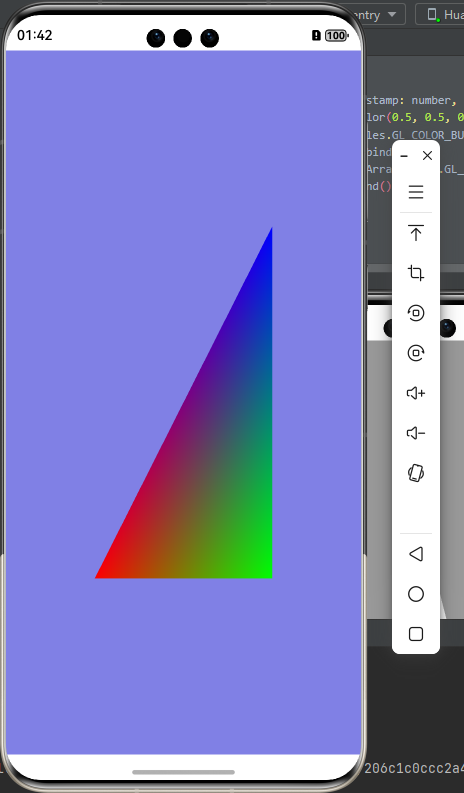

# @jemoc/glview

---

## 简单介绍

GLView组件可以在arkTs侧进行opengl和egl操作。支持按需渲染和连续渲染。 GLView2使用worker实现

---

### 下载安装

```shell
ohpm install @jemoc/glview
```

api12需要在工程级build-profile.json5中修改配置,添加Sendable
function的支持  [详细](https://developer.huawei.com/consumer/cn/doc/harmonyos-guides-V13/arkts-sendable-V13#sendable-function)

```json
{
  "app": {
    "products": [
      {
        "compatibleSdkVersionStage": "beta3"
      }
    ]
  }
}
```

---

## GLView和GLViewV2

### 接口

```typescript
GLView({
  controller: GLViewController,
  eglContextClientVersion: number,
  renderMode: GLViewRenderMode,
  expectedFrameRange: ExpectedFrameRateRange
})

//V2组件版本  
GLViewV2({
  controller: GLViewController,
  eglContextClientVersion: number,
  renderMode: GLViewRenderMode,
  expectedFrameRange: ExpectedFrameRateRange
})
```

| 参数名                     | 类型                     | 必填 | 说明                                                                                                    |
|-------------------------|------------------------|----|-------------------------------------------------------------------------------------------------------|
| controller              | GLViewController       | 否  | 渲染控制器,继承自XComponentController,需要开发者实现onSurfaceCreated、onSurfaceDestroy、onSurfaceChanged、onDrawFrame方法 |
| eglContextClientVersion | number                 | 否  | 设置egl context client版本，默认值2                                                                           |
| renderMode              | GLViewRenderMode       | 否  | 设置组件渲染模式， 默认值 WHEN_DIRTY                                                                              |
| expectedFrameRange      | ExpectedFrameRateRange | 否  | displaySync期望帧率                                                                                       |

### GLViewRenderMode

| 枚举名          | 说明                                                                         |
|--------------|----------------------------------------------------------------------------|
| WHEN_DIRTY   | 按需渲染/手动渲染，当onSurfaceCreated回调后会自动绘制一帧。开发者需要通过controller调用requestRender进行绘制 |
| CONTINUOUSLY | 连续渲染， 组件通过vSync进行连续渲染                                                      |

### GLViewController

<font color="red">GLViewController在1.2.0版作出变更，此类继承XComponentController(画中画需要XComponentController)</font>

#### onSurfaceCreated(surfaceId: string): void

- 组件创建Surface成功时调用此方法，开发者可以在此方法初始化opengl所需要的资源,此方法也是XComponentController的onSurfaceCreated方法

#### onSurfaceChanged(surfaceId: string,rect: SurfaceRect): void

- 组件Surface大小改变时调用此方法,此方法也是XComponentController的onSurfaceChanged方法

#### onSurfaceDestroyed(surfaceId: string): void

- 组件Surface销毁时调用此方法，开发者需要在此方法销毁opengl资源,此方法也是XComponentController的onSurfaceDestroyed方法

#### onDrawFrame(timestamp: number, targetTimeStamp: number): boolean

- 组件绘制每一帧都会调用此方法,通过返回值影响是否执行swapBuffer，可以改变渲染速率

#### setEGLContextClientVersion(version: number): void

- 设置egl context client版本。此方法需要在onSurfaceCreated前使用。此方法与组件接口eglContextClientVersion冲突。

#### setRenderMode(mode: GLViewRenderMode):void

- 更改组件渲染模式

#### makeCurrent(): boolean

- 绑定egl上下文

#### swapBuffer(): void

- 交换前缓冲区和后缓冲区

#### requestRender(): void

- 请求渲染一帧，onDrawFrame中如果返回false则不渲染

#### get eglDisplay(): EGLDisplay

- 获取EGLDisplay,子类可重写方法，实现自己的需求

#### get eglConfig(): EGLConfig

- 获取EGLConfig,子类可重写方法，实现自己的需求

#### get eglContext(): EGLContext

- 获取EGLContext,子类可重写方法，实现自己的需求

#### get eglSurface(): EGLSurface

- 获取EGLSurface,子类可重写方法，实现自己的需求

---

## GLView2和GLView2V2

### 接口

```typescript
GLView2({
  controller: GLController,
  eglContextClientVersion: number,
  renderMode: GLViewRenderMode,
  render: GLRender
})
```

| 参数名                     | 类型                     | 必填 | 说明                                                                              |
|-------------------------|------------------------|----|---------------------------------------------------------------------------------|
| controller              | GLController           | 否  | 与GLViewController不同，仅提供setRenderMode、requestRender等方法，同样继承自XComponentController |
| eglContextClientVersion | number                 | 否  | 设置egl context client版本，默认值2                                                     |
| renderMode              | GLViewRenderMode       | 否  | 设置组件渲染模式， 默认值 WHEN_DIRTY                                                        |
| render                  | GLRender               | 否  | 需要开发者实现onSurfaceCreated、onSurfaceDestroy、onSurfaceChanged、onDrawFrame方法         |
| expectedFrameRateRange  | ExpectedFrameRateRange | 否  | vSync期望帧率                                                                       |
| eglFactory              | EGLFactory             | 否  | EGLConfig、EGLSurface、EGLContext创建工厂                                             |

### GLController

#### setEGLContextClientVersion(version: number): void

- 设置egl context client版本。此方法需要在onSurfaceCreated前使用。此方法与组件接口eglContextClientVersion冲突。

#### setRenderMode(mode: GLViewRenderMode):void

- 更改组件渲染模式

#### requestRender():void

- WHEN_DIRTY模式下请求绘制一帧

#### execute<T extends GLRender>(callback: SendableCallback<T>)

- 发送一个@Sendable装饰的function。此方法下提供egl环境

```typescript
//例如使用execute方法来更新NativeImage
@Sendable
function updateNativeImage(render: MyRender) { //MyRender是自实现GLRender类，
  render.nativeImage.updateSurfaceImage();
}

//虽然官方文档说不可在listener中调用NativeImage其他方法，但更新请求需要发送到worker中，不就等于是异步执行了
nativeImage.setOnFrameAvailableListener(() => {
  glController.execute(updateFrame) //glController是GLController的实例
})
```

### GLRender

GLRender继承自”lang.ISendable“,实现OpenGL渲染

```typescript
interface GLRender extends lang.ISendable {
onSurfaceCreated(): void;

onSurfaceChanged(width: number, height: number): void;

onSurfaceDestroyed(): void;

onDrawFrame(timestamp: number, targetTimestamp: number): boolean;
}
```

### EGLFactory

EGLFactory继承自”lang.ISendable“，提供EGL环境支持

```typescript
interface EGLFactory extends lang.ISendable {
getConfig(display: egl.EGLDisplay): egl.EGLConfig

getContext(display: egl.EGLDisplay, eglContextClientVersion: number): egl.EGLContext

getSurface(display: egl.EGLDisplay, surfaceId: string): egl.EGLSurface

destroy(display: egl.EGLDisplay): void
}
```

---

## GLView和GLView2区别

GLView2使用worker实现，不阻塞UI线程。简单绘制使用GLView方便，GLView2需要sendable支持

---

### 示例

```typescript
const vertexShaderSource: string =
  `#version 300 es
        layout(location = 0) in vec3 a_position;
        layout(location = 1) in vec3 a_color;
        out vec4 v_color;
        void main()
        {
            gl_Position = vec4(a_position, 1.0);
            v_color = vec4(a_color, 1.0);
        }`;
const fragmentShaderSource: string =
  `#version 300 es
     precision mediump float;
      out vec4 fragColor;
      in vec4 v_color;
      void main()
      {
          fragColor = v_color;
      }`;

const vertex_list: Float32Array = new Float32Array([
  -0.5, -0.5, 0.0, 1.0, 0.0, 0.0,
  0.5, -0.5, 0.0, 0.0, 1.0, 0.0,
  0.5, 0.5, 0.0, 0.0, 0.0, 1.0,
  -0.5, 0.5, 0.0, 0.0, 0.0, 0.0
]);
```

#### 实现GLViewController

```typescript
import { GLViewController, gles } from '@jemoc/glview'

//gles使用案例见@jemoc/gles

class MyController extends GLViewController {
  private program?: gles.Program;
  private vao?: gles.VertexArray;
  private vbo?: gles.Buffer;

  onSurfaceChanged(surfaceId: string, rect: SurfaceRect): void {
    gles.glViewport(0, 0, rect.surfaceWidth, rect.surfaceHeight);
  }

  onSurfaceDestroyed(): void {
    //回收buffer和program
    gles.glDeleteBuffers([this.vbo]);
    gles.glDeleteProgram(this.program);
    gles.glDeleteVertexArrays([this.vao]);
  }

  onSurfaceCreated(surfaceId: string): void {
    this.program = new gles.Program();
    let vertexShader: gles.Shader2 = gles.Shader2.fromString(gles.GL_VERTEX_SHADER, this.vertexShaderSource);
    let fragmentShader: gles.Shader2 = gles.Shader2.fromString(gles.GL_FRAGMENT_SHADER, this.fragmentShaderSource);
    if (!program.attach(vertexShader, fragmentShader)) {
      throw Error('compile program fail')
    }
    //program.detach(vertexShader, fragmentShader);
    this.vao = new gles.VertexArray();
    this.vbo = new gles.Buffer(gles.GL_ARRAY_BUFFER);
    vbo.setData(this.vertex_list, gles.GL_STATIC_DRAW);
    vao.setBuffer(vbo, 0, 3, gles.GL_FLOAT, false, 24, 0);
    vao.enable(0);
    vao.setBuffer(vbo, 1, 3, gles.GL_FLOAT, false, 24, 12);
    vao.enable(1);
    vao.unbind();
    this.program = program;
    this.vao = vao;
    this.vbo = vbo;
  }

  onDrawFrame(timestamp: number, targetTimestamp: number): void {
    gles.glClearColor(0.6, 0.6, 0.6, 1.0);
    gles.glClear(gles.GL_COLOR_BUFFER_BIT | gles.GL_DEPTH_BUFFER_BIT);
    this.program?.bind();
    this.vao?.glDrawArrays(gles.GL_TRIANGLES, 0, 3);
  }
}
```

#### 使用组件

```text
import {GLView, GLViewRenderMode} from '@jemoc/glview'

@Component
struct Index {
  private controller: MyController = new MyController();
  @State renderMode: GLViewRenderMode = GLViewRenderMode.WHEN_DIRTY;
  
  build() {
    Column() {
       GLView({
          controller: this.controller,
          renderMode: this.renderMode,
          eglContextClientVersion: 2
       })
    }
  }
}
```

### GLView2示例

#### 实现GLRender

```typescript
@Sendable
class MyRender implements GLRender {
  private vbo?: gles.Buffer2;
  private vao?: gles.VertexArray2;
  private program?: gles.Program2;

  onSurfaceCreated(): void {
    let program = new gles.Program2();
    let vertexShader: gles.Shader2 = gles.Shader2.fromString(gles.GL_VERTEX_SHADER, vertexShaderSource);
    let fragmentShader: gles.Shader2 = gles.Shader2.fromString(gles.GL_FRAGMENT_SHADER, fragmentShaderSource);
    if (!program.attach(vertexShader, fragmentShader)) {
      throw Error('compile program fail')
    }
    //program.detach(vertexShader, fragmentShader);
    let vao = new gles.VertexArray2();
    let vbo = new gles.Buffer2(gles.GL_ARRAY_BUFFER);
    vbo.setData(vertex_list, gles.GL_STATIC_DRAW);
    vao.setBuffer(vbo, 0, 3, gles.GL_FLOAT, false, 24, 0);
    vao.enable(0);
    vao.setBuffer(vbo, 1, 3, gles.GL_FLOAT, false, 24, 12);
    vao.enable(1);
    vao.unbind();
    this.program = program;
    this.vao = vao;
    this.vbo = vbo;
  }

  onSurfaceChanged(width: number, height: number): void {
  }

  onSurfaceDestroyed(): void {
    this.program?.delete()
    this.vao?.delete()
    this.vbo?.delete()
  }

  onDrawFrame(timestamp: number, targetTimestamp: number): boolean {
    gles.glClearColor(0.5, 0.5, 0.9, 1.0);
    gles.glClear(gles.GL_COLOR_BUFFER_BIT | gles.GL_DEPTH_BUFFER_BIT);
    this.program?.bind();
    this.vao?.drawArrays(gles.GL_TRIANGLES, 0, 3);
    this.vao?.unbind();
    return true;
  }
}
```

```text
@Component
struct Index {
  private render: MyRender = new MyRender();
  private controller: GLController = new GLController();
  @State renderMode: GLViewRenderMode = GLViewRenderMode.WHEN_DIRTY;
  
  build() {
    Column() {
       GLView2({
          controller: this.controller,
          render: this.render,
          renderMode: this.renderMode,
       })
    }
  }
}
```



### 分享BuilderNode配合NativeImage案例

#### 实现要导出纹理的BuilderNode

```text
//MyComponent.ets
@Component
struct MyComponent {
  build() {
    //组件内容
  }
}

@Builder
function BuildMyComponent() {
  MyComponent()
}

```

```typescript
//MyBuilderNode.ets
class MyBuilderNode extends NodeController {
  private myNode: BuilderNode<ESObject> | null = null
  surfaceId: string = ''

  makeNode(context: UIContext): FrameNode | null {
    if (!this.myNode) {
      this.myNode = new BuilderNode(context, { surfaceId: this.surfaceId, type: NodeRenderType.RENDER_TYPE_TEXTURE })
      this.myNode.build(wrapBuilder(BuildMyComponent))
    }
    return this.myNode.getFrameNode()
  }
}
```

#### 实现GLRender

```typescript
//MyRender.ets
import { gles } from '@jemoc/glview'

@Sendable
class MyRender implements GLRender {
  nativeImage: gles.NativeImage
  texture?: gles.Texture2

  constructor() {
    this.nativeImage = new gles.NativeImage()
  }

  onSurfaceCreated(): void {
    this.texture = new gles.Texture2(gles.GL_TEXTURE_EXTERNAL_OES);
    this.texture
      .setParameter(gles.GL_TEXTURE_WRAP_S, gles.GL_REPEAT)
      .setParameter(gles.GL_TEXTURE_WRAP_T, gles.GL_REPEAT)
      .setParameter(gles.GL_TEXTURE_MIN_FILTER, gles.GL_LINEAR)
      .setParameter(gles.GL_TEXTURE_MAG_FILTER, gles.GL_LINEAR)

    let error = this.nativeImage.attachContext(this.texture.id);

    //开发者其他初始化内容
  }

  onSurfaceChanged(width: number, height: number): void {

  }

  onSurfaceDestroyed(): void {
    this.nativeImage.destroy()
    this.texture.delete()
    //开发者实现的资源回收
  }

  onDrawFrame(timestamp: number, targetTimestamp: number): boolean {
    //开发者实现的纹理渲染
    return true;
  }
}

```

#### BuilderNode绑定NativeImage的surfaceId,并通过NativeImage的FrameAvailable回调更新纹理和完成渲染

```text
//Index.ets
@Sendable
function updateFrame(render: MyRender) {
  render.nativeImage.updateSurfaceImage()
}

@Component
struct Index {
  private myRender: MyRender = new MyRender()
  private controller: GLController = new GLController()
  private myNode: MyBuilderNode = new MyBuilderNode();
  
  aboutToAppear(){
    this.myNode.surfaceId = this.myRender.nativeImage.surfaceId;
    this.myRender.nativeImage.setOnFrameAvailableListener(() => {
      this.controller.execute(updateFrame)
      this.controller.requestRender()
    })
  }
  build(){
    Stack() {
      NodeContainer(this.myNode)
      GLView2({
        mode: GLViewRenderMode.WHEN_DIRTY,
        controller: this.controller,
        render: this.myRender
      })
    }
  }
}
```
